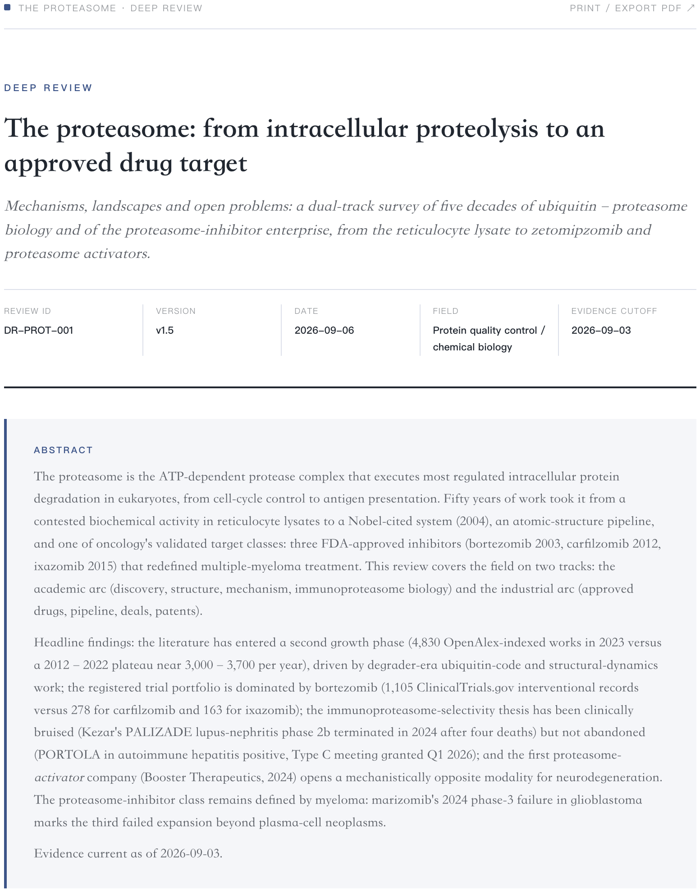
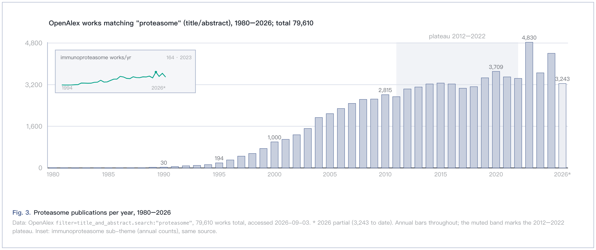
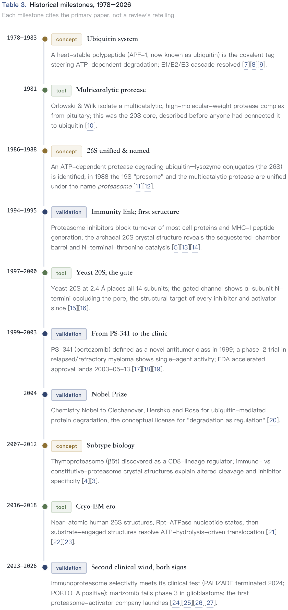
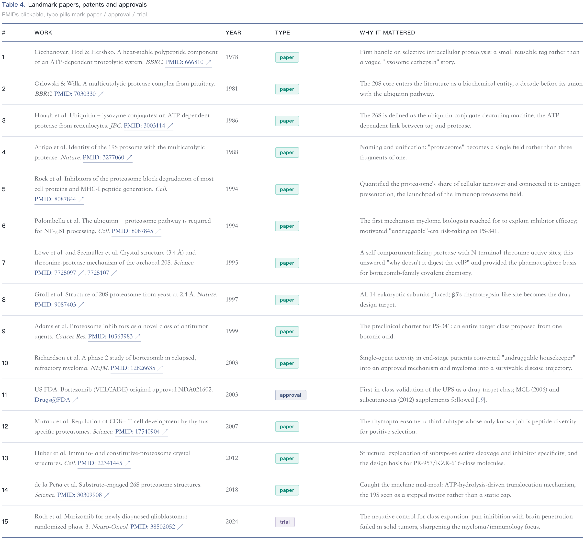
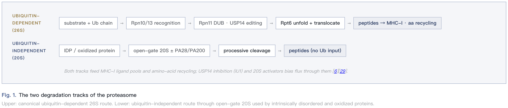
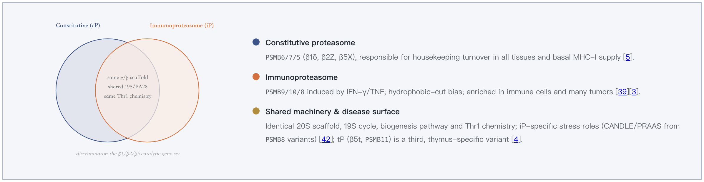
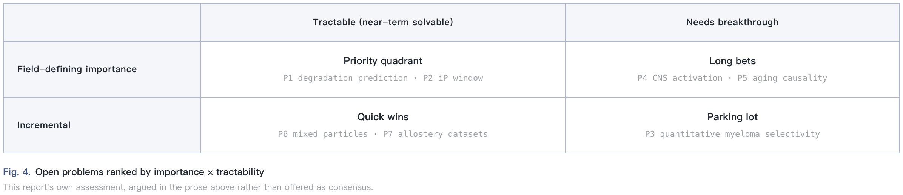
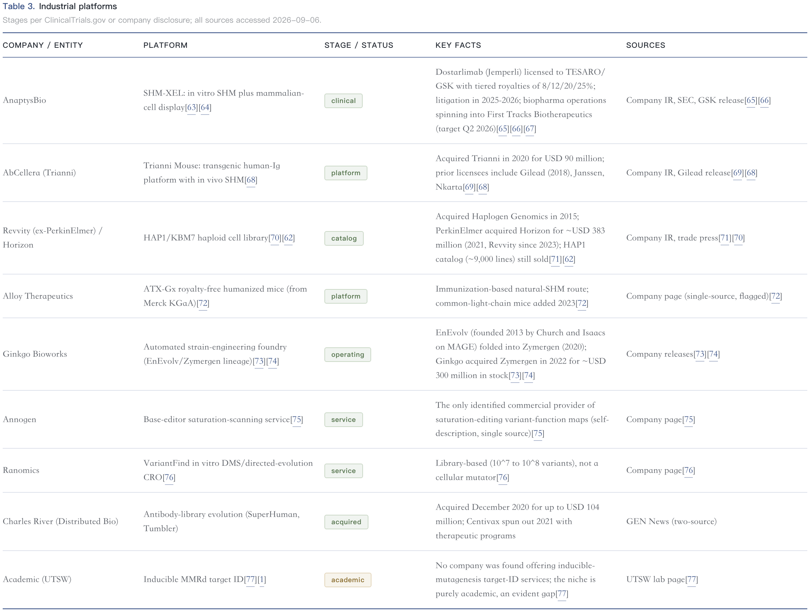

# DeepReview

**Evidence-first deep field-survey skill for ZCode.** Give it a topic — molecular glue, RNA editing, solid-state batteries, CAR-T — and it runs a full domain survey: historical evolution → landmark works → dual-track landscape (academic **and** industrial) → research fronts → ranked open problems → outlook, rendered as a polished bilingual (EN/ZH) report with verified, clickable citations and a reproducible search appendix.

> 深度调研 / 深度综述 / deep dive / landscape report / field survey — if the user asks for one of these, this is the skill.

---

## Demo gallery

All figures below are live-rendered components from real DeepReview outputs (no mockups). Reports cited: `DR-PROT-001` (proteasome, v1.5) and `DR-MUT-001` (in vivo mutagenesis systems, v1.2).

| | |
|---|---|
| **Report opening** — title block, meta-grid (review ID / version / evidence cutoff) and a two-track abstract.<br> | **Publication trend** — real OpenAlex annual counts on a continuous axis, plateau band, partial-year marker and sub-theme inset. Never sketched by eye.<br> |
| **Vertical-spine timeline** — milestones typed by role (concept / tool / validation), each citing the primary paper.<br> | **Landmark works table** — booktabs style, type pills, and every PMID clickable straight to PubMed.<br> |
| **Mechanism pathway** — competing frameworks drawn as parallel lanes converging on shared readouts.<br> | **Venn contrast** — shared core vs discriminators, panel-derived hues with an explicit lens.<br> |
| **Open-problem 2×2** — importance × tractability; the priority quadrant is top-LEFT, argued in prose not asserted.<br> | **Industrial pipeline table** — stage pills, key facts with deal values, and a source + access date on every row (two-source rule).<br> |

## Why it looks like this

* **Citations open PubMed directly.** Every in-text `[n]` is an external anchor to the reference's PubMed/DOI record (`target="_blank" rel="noopener"`): one anchor per number, ranges expanded, zero bare `[n]` after stripping anchors. A scripted QC gate fails the build on any stray internal `#ref-n` anchor or unverified PMID.
* **Evidence before prose.** No sentence is written before its supporting source exists in the workspace's `evidence_log.md`; every load-bearing claim traces to a log row with URL + access date and an A/B/C confidence grade.
* **Dual-track by construction.** The academic track (≥ 20 core references, PubMed E-utilities + OpenAlex bibliometrics) and the industry track (≥ 8 pipeline/company entries, ClinicalTrials.gov / FDA / patents, two-source rule on volatile numbers) are separate research passes with separate minimums — never a token "industry outlook" paragraph.
* **Reproducible.** Methods ships every query verbatim with run dates and PRISMA-lite counts; version, dates and all computed counts are injected from a single constants block (`{{DR_VERSION}}`, `{{NPMID}}`, …), so prose can never drift from the data.
* **De-AI'd typography.** Zero em-dashes in rendered output, academic-register ban lists (EN/ZH), every `table.bk` carries a real `<thead>`, booktabs cell spacing rules — style is a hard gate, not a suggestion.
* **Ten journal palette panels** (`nature / nejm / lancet / science / jama` + graphite / solar / forest / orchid / rose) derive every color from one source (`assets/palettes.py`); a shipped switcher lets readers flip panels live.

## Quick start

Copy the skill into your ZCode skills directory:

```bash
git clone https://github.com/operoncao123/deep-review.git
mkdir -p ~/.zcode/skills
cp -R DeepReview ~/.zcode/skills/deep-review
```

Then prompt naturally:

* `非降解性分子胶 深度调研` → bilingual HTML report, dual-track, 30–60 refs
* `deep dive on solid-state electrolytes, quick pass, English only`
* `把 DR-GKI-001 工作区更新到 2026-12`（update mode: refreshes both tracks since the old evidence cutoff, bumps version, keeps reference numbering stable）

Rendered deliverables land in `deep_review_<topic>_<YYYYMMDD>/final/` with a workspace handoff: `evidence_log.md`, `references.bib`, `figures/`, and build scripts that exit non-zero on any QC failure.

## Workflow

```
Phase 0  Scope          scope card: term boundaries vs adjacent concepts, time window,
                        template choice (nature-html default / manuscript-docx / markdown)
Phase 1  Research       two parallel subagents → evidence_log.md rows (not prose);
                        saturation rule: stop when the last 10 results add nothing
Phase 2  Synthesis      cluster into the 11-section skeleton; 3–5 data-driven figures;
                        citation→PMID/DOI map; references.bib
Phase 3  Render & QC    build script assembles the HTML, links citations, injects meta
                        tokens, and runs hard gates (exit 1 on FAIL)
```

The 11-section skeleton: Abstract · Scope & Definitions · Historical Timeline · Landmark Works · Mechanisms & Paradigms · Academic Landscape · Industrial Landscape · Research Fronts · Open Problems · Outlook · Methods · References.

## Repository layout

```
SKILL.md                      the skill: workflow, templates, quality gates
references/
  section_guide.md            per-section content requirements + figure specs
  search_playbook.md          database-by-database query patterns (copy-paste APIs)
  qc_checklist.md             full pre-delivery checklist (hard gates in bold)
assets/
  nature_review_template.html default render target (self-contained)
  deepreview_build.py         build core: citation numbering/linking, colgroups,
                              meta tokens, trend trimming, QC gates
  palettes.py                 ten journal palette panels, one color source
  build_manuscript_template.py + manuscript_template.docx
  review_skeleton.md          markdown fallback
demo/                         figure captures from real outputs (this README's gallery)
```

## 中文简介

DeepReview 是一个"深度调研"技能：对任意科研/产业主题执行 **历史脉络 → 里程碑工作 → 学术+产业双轨全景 → 研究前沿 → 开放问题 → 展望** 的完整调研，交付中英双语的 Nature Protocols 风格 HTML 报告（可选 DOCX / Markdown）。三条底线：先证据后成文（每句话可溯源到证据日志）；学术与产业两条线分开调研、各有覆盖底线；检索策略全程留档可复现。正文引用编号 `[n]` 直接链到 PubMed/DOI 记录，构建脚本对所有引用与格式硬门禁负责，任何一项不过即构建失败。

## Notes

* Demo figures are cropped from internal review reports (`DR-PROT-001`, `DR-MUT-001`); their full workspaces are not part of this repository.
* The skill expects PubMed E-utilities / OpenAlex / ClinicalTrials.gov network access during the research phase; rendering itself is offline and self-contained.
