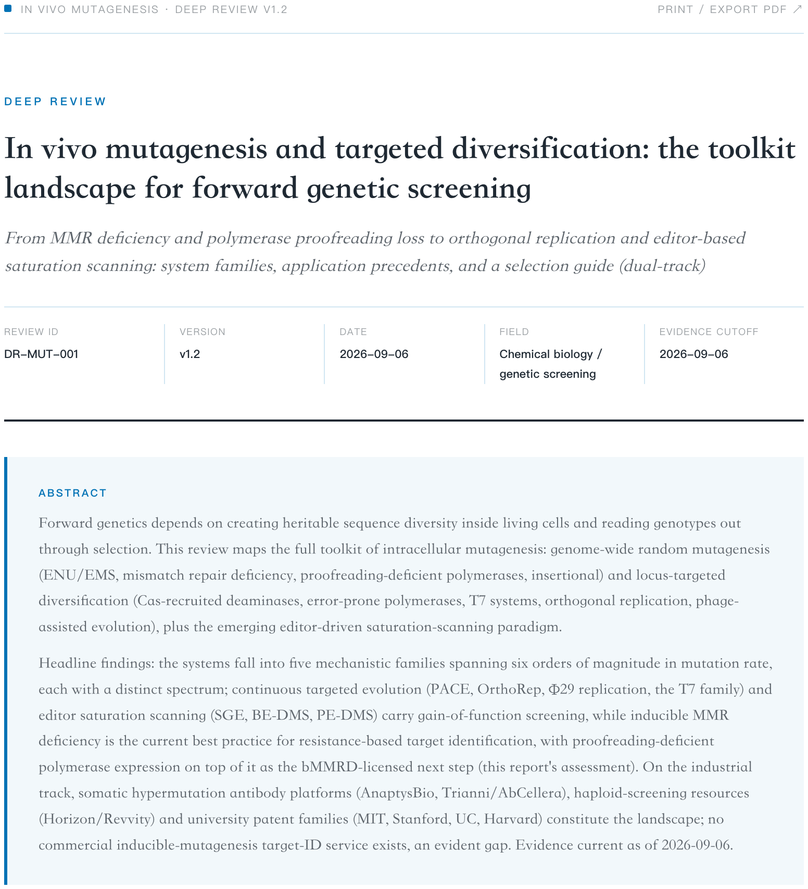
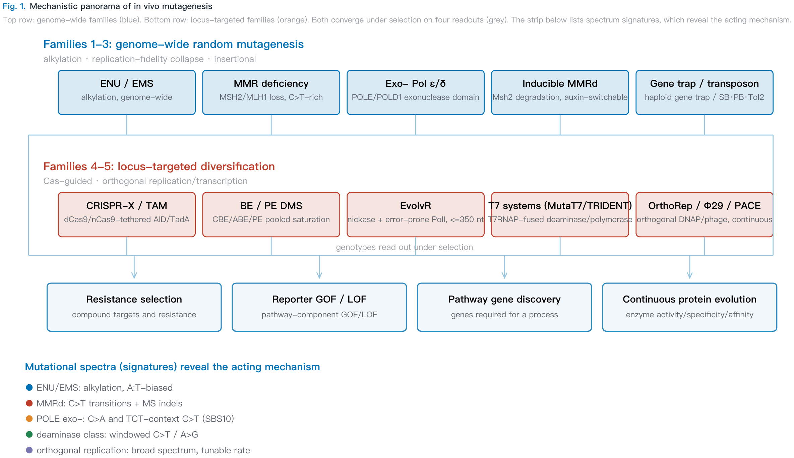
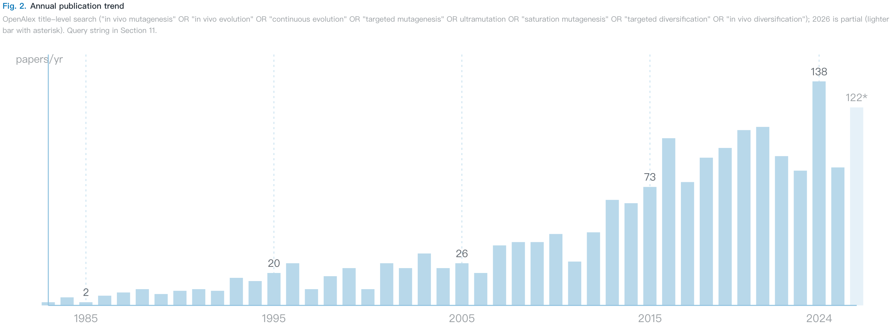
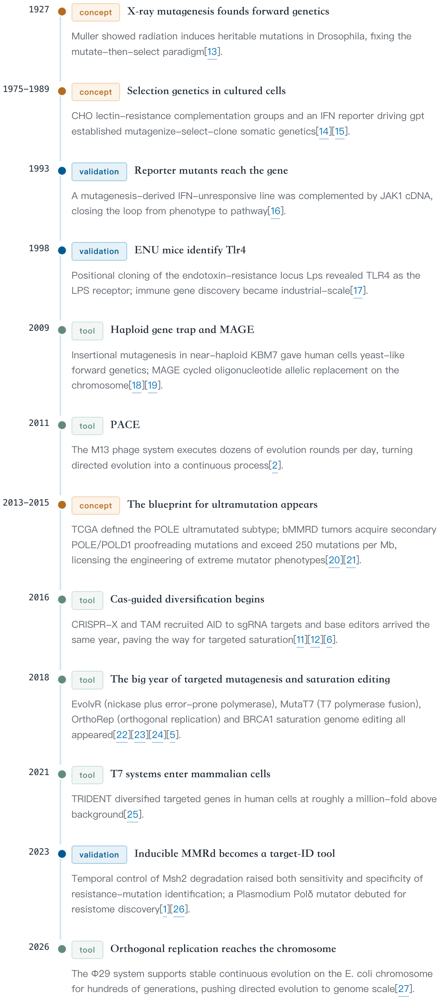
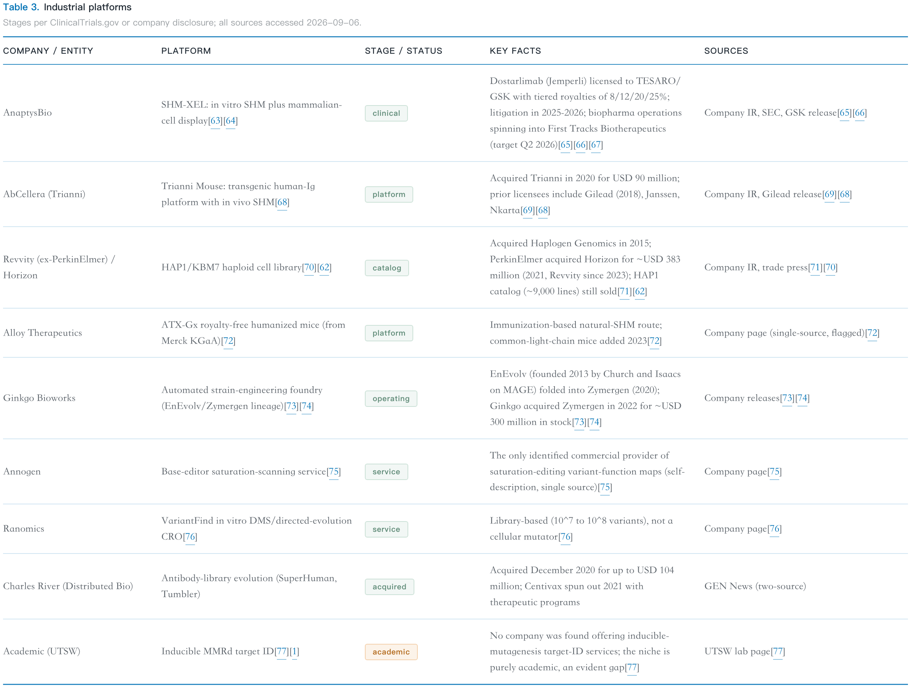
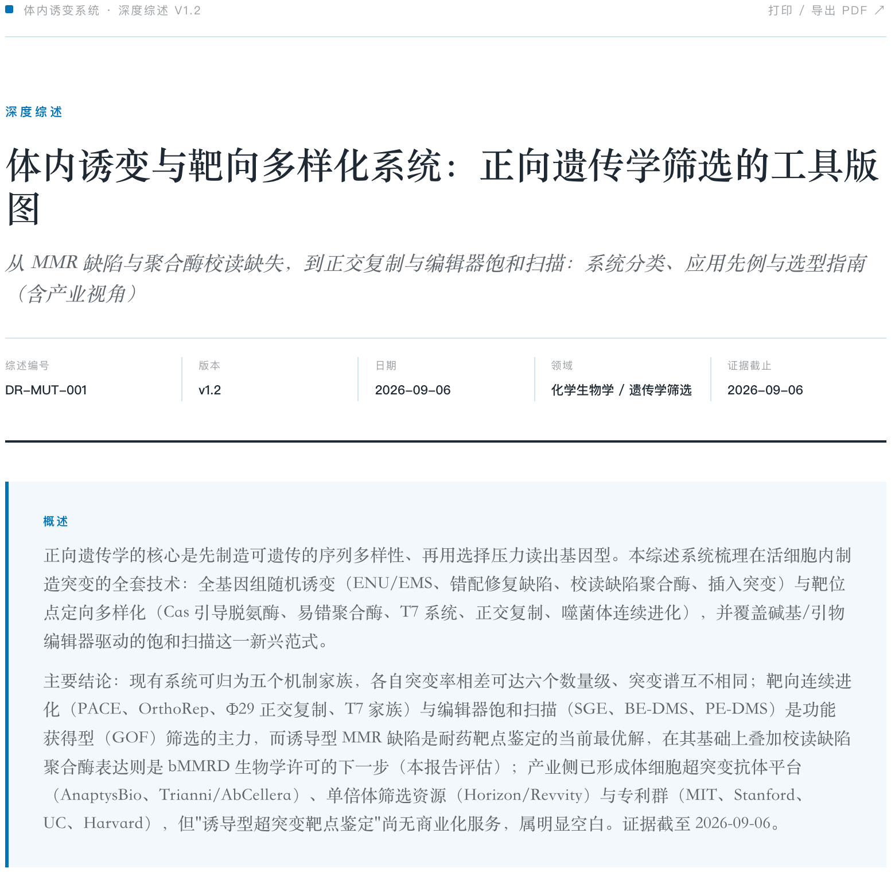
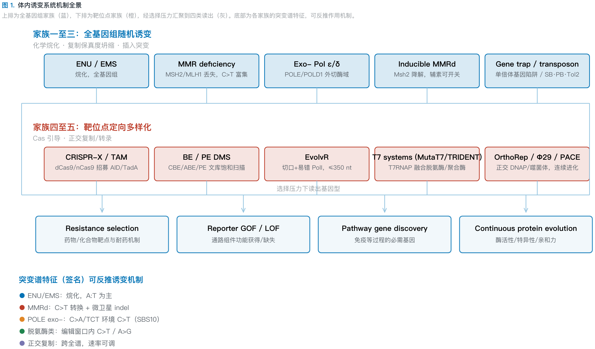
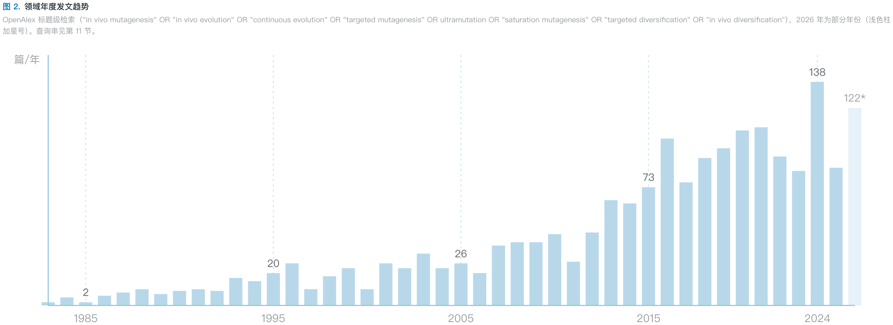
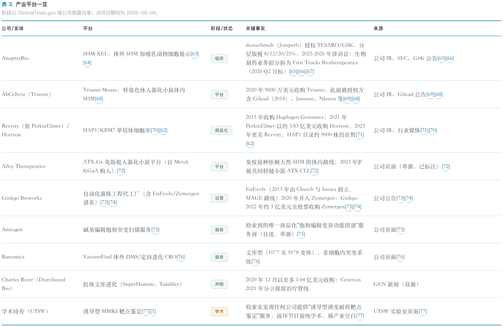

# DeepReview

**Evidence-first deep field-survey skill for AI coding agents.** Give it a topic — molecular glue, RNA editing, solid-state batteries, CAR-T — and it runs a full domain survey: historical evolution → landmark works → dual-track landscape (academic **and** industrial) → research fronts → ranked open problems → outlook, rendered as a polished bilingual (EN/ZH) report with verified, clickable citations and a reproducible search appendix.

> 深度调研 / 深度综述 / deep dive / landscape report / field survey — if the user asks for one of these, this is the skill.

Works with **Claude Code, OpenAI Codex CLI, ZCode, TRAE, OpenCode and WorkBuddy** — see [Compatibility](#compatibility--one-skill-six-agents).

---

## Demo gallery

All figures are live-rendered components captured from real DeepReview outputs (no mockups), in both languages, **NEJM blue-red palette panel** (one of ten shipped panels). Source report: `DR-MUT-001` — *In vivo mutagenesis and targeted diversification* v1.2.

### English

| | |
|---|---|
| **Report opening** — title block, meta-grid (review ID / version / evidence cutoff) and a dual-track abstract.<br> | **Mechanistic panorama** — genome-wide families (blue) and locus-targeted families (orange) converging under selection on four readouts.<br> |
| **Publication trend** — real OpenAlex annual counts on a continuous axis, partial-year bar marked with an asterisk. Never sketched by eye.<br> | **Vertical-spine timeline** — milestones typed by role (concept / tool / validation), each citing the primary paper.<br> |
| **Industrial platforms table** — stage pills, key facts with deal values, and a source + access date on every row (two-source rule).<br> | |

### 中文

| | |
|---|---|
| **报告开篇** — 标题区、元信息栏（综述编号 / 版本 / 证据截止）与双语同构的概述。<br> | **机制全景图** — 全基因组随机诱变家族（蓝）与靶位定向多样化家族（橙）在选择压下汇合于四类读出。<br> |
| **发文趋势** — OpenAlex 真实逐年计数、连续年度坐标轴，不完整年份以浅色柱加星号标注。<br> | **垂直时间轴** — 里程碑按角色打标（概念 / 工具 / 验证），每条都引一手文献。<br> |
| **产业平台表格** — 阶段 pill、关键事实含交易金额，每行都有来源与访问日期（两源规则）。<br> | |

## Compatibility — one skill, six agents

The skill is a plain [Agent Skills](https://simonwillison.net/2025/Dec/12/openai-skills/) folder (`SKILL.md` + assets), which most agents load natively. One script installs everything:

```bash
git clone https://github.com/operoncao123/deep-review.git
cd deep-review
./integrations/install.sh                 # everywhere detected
./integrations/install.sh codex trae      # …or only these tools
```

| Agent | Loading mechanism | Installed to | Invoke |
|---|---|---|---|
| **Claude Code** | native skills loader | `~/.claude/skills/deep-review/` | just ask: `深度调研 X` |
| **OpenAI Codex CLI** | native (skills, Dec 2025+) | `~/.codex/skills/deep-review/` | just ask |
| **ZCode** | native skills loader | `~/.zcode/skills/deep-review/` | just ask |
| **TRAE** | skills + rules fallback | `~/.trae/skills/deep-review/` (+ rules snippet) | just ask |
| **OpenCode** | slash-command file | `~/.config/opencode/command/deep-review.md` | `/deep-review <topic>` |
| **WorkBuddy** | its own Create Skills flow (`skill.yml`) | manual, 2-minute guide | new task with any 深度调研 topic |
| *anything reading `~/.agents/skills`* | cross-agent standard dir | `~/.agents/skills/deep-review/` | agent-dependent |

Details and manual steps: [`integrations/README.md`](integrations/README.md).

## Why it looks like this

* **Citations open PubMed directly.** Every in-text `[n]` is an external anchor to the reference's PubMed/DOI record (`target="_blank" rel="noopener"`): one anchor per number, ranges expanded, zero bare `[n]` after stripping anchors. A scripted QC gate fails the build on any stray internal `#ref-n` anchor or unverified PMID.
* **Evidence before prose.** No sentence is written before its supporting source exists in the workspace's `evidence_log.md`; every load-bearing claim traces to a log row with URL + access date and an A/B/C confidence grade.
* **Dual-track by construction.** The academic track (≥ 20 core references, PubMed E-utilities + OpenAlex bibliometrics) and the industry track (≥ 8 pipeline/company entries, ClinicalTrials.gov / FDA / patents, two-source rule on volatile numbers) are separate research passes with separate minimums — never a token "industry outlook" paragraph.
* **Reproducible.** Methods ships every query verbatim with run dates and PRISMA-lite counts; version, dates and all computed counts are injected from a single constants block (`{{DR_VERSION}}`, `{{NPMID}}`, …), so prose can never drift from the data.
* **De-AI'd typography.** Zero em-dashes in rendered output, academic-register ban lists (EN/ZH), every `table.bk` carries a real `<thead>`, booktabs cell-spacing rules — style is a hard gate, not a suggestion.
* **Ten journal palette panels** (`nature / nejm / lancet / science / jama` + graphite / solar / forest / orchid / rose) derive every colour from one source (`assets/palettes.py`); a shipped switcher lets readers flip panels live. The gallery above uses the `nejm` panel.

## Quick start

```bash
./integrations/install.sh claude        # or codex / zcode / trae / opencode / workbuddy
```

Then prompt naturally:

* `非降解性分子胶 深度调研` → bilingual HTML report, dual-track, 30–60 refs
* `deep dive on solid-state electrolytes, quick pass, English only`
* `把 DR-MUT-001 工作区更新到 2026-12`（update mode: refreshes both tracks since the old evidence cutoff, bumps version, keeps reference numbering stable）

Rendered deliverables land in `deep_review_<topic>_<YYYYMMDD>/final/` with a workspace handoff: `evidence_log.md`, `references.bib`, `figures/`, and build scripts that exit non-zero on any QC failure.

## Workflow

```
Phase 0  Scope          scope card: term boundaries vs adjacent concepts, time window,
                        template choice (nature-html default / manuscript-docx / markdown)
Phase 1  Research       two parallel subagents → evidence_log.md rows (not prose);
                        saturation rule: stop when the last 10 results add nothing
Phase 2  Synthesis      cluster into the 11-section skeleton; 3–5 data-driven figures;
                        citation→PMID/DOI map; references.bib
Phase 3  Render & QC    build script assembles the HTML, links citations, injects meta
                        tokens, and runs hard gates (exit 1 on FAIL)
```

The 11-section skeleton: Abstract · Scope & Definitions · Historical Timeline · Landmark Works · Mechanisms & Paradigms · Academic Landscape · Industrial Landscape · Research Fronts · Open Problems · Outlook · Methods · References.

## Repository layout

```
SKILL.md                      the skill: workflow, templates, quality gates
references/
  section_guide.md            per-section content requirements + figure specs
  search_playbook.md          database-by-database query patterns (copy-paste APIs)
  qc_checklist.md             full pre-delivery checklist (hard gates in bold)
assets/
  nature_review_template.html default render target (self-contained)
  deepreview_build.py         build core: citation numbering/linking, colgroups,
                              meta tokens, trend trimming, QC gates
  palettes.py                 ten journal palette panels, one colour source
  build_manuscript_template.py + manuscript_template.docx
  review_skeleton.md          markdown fallback
integrations/
  install.sh                  one-shot installer for all six agents
  opencode-command.md         slash-command adapter (→ ~/.config/opencode/command/)
  trae-rules-snippet.md       rules fallback for TRAE (.trae/rules/project_rules.md)
  workbuddy-skill.yml.md      WorkBuddy Create Skills guide + description
  make_demos.py               regenerates the demo/ captures from a report
demo/                         bilingual figure captures (this README's gallery)
```

## 中文简介

DeepReview 是一个"深度调研"技能：对任意科研/产业主题执行 **历史脉络 → 里程碑工作 → 学术+产业双轨全景 → 研究前沿 → 开放问题 → 展望** 的完整调研，交付中英双语的 Nature Protocols 风格 HTML 报告（可选 DOCX / Markdown）。三条底线：先证据后成文（每句话可溯源到证据日志）；学术与产业两条线分开调研、各有覆盖底线；检索策略全程留档可复现。正文引用编号 `[n]` 直接链到 PubMed/DOI 记录，构建脚本对所有引用与格式硬门禁负责，任何一项不过即构建失败。支持 Claude Code、OpenAI Codex、ZCode、TRAE、OpenCode、WorkBuddy 六个工具，`./integrations/install.sh` 一键安装。

## Notes

* Demo figures are cropped from an internal review report (`DR-MUT-001`, EN + ZH); the full workspace is not part of this repository. `integrations/make_demos.py` regenerates them.
* The skill expects PubMed E-utilities / OpenAlex / ClinicalTrials.gov network access during the research phase; rendering itself is offline and self-contained.
